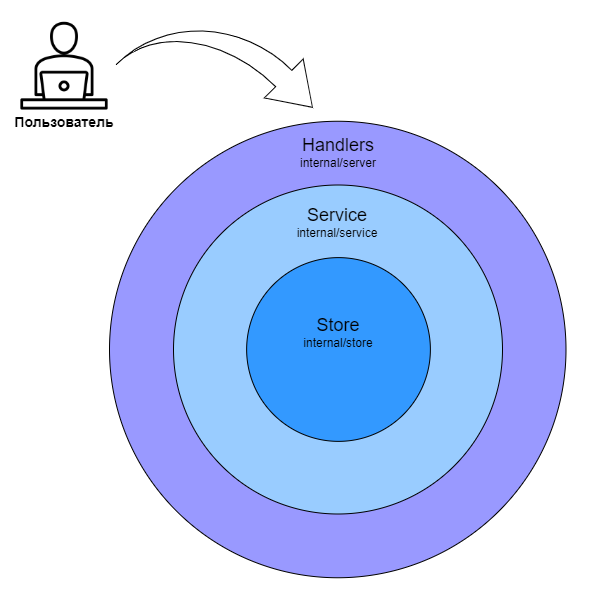

# QuickOn — система для обучения новых сотрудников

- [Общая информация](#info)

- [Работа с приложением](#work)
  - [Управление приложением (Makefile)](#work-management)
  - [Локальный запуск приложения](#work-local)
- [Разработка приложения](#develop)
  - [Название веток](#develop-naming-branch)
  - [Некоторые правила по коду](#develop-code-style)
  - [Тестирование](#develop-test)
  - [Отправка PR на ревью](#develop-pr)
- [Архитектура](#arch)
  - [Схема БД](#arch-db)


# Общая информация <a name="info"/>

Реализация HTTP API системы для обучения новых сотрудников «QuickOn»: проект курса «Акселератор».


# Работа с приложением <a name="work"/>

## Управление приложением (Makefile) <a name="work-management"/>
Подготовка приложения, тестирование, запуск на локальной машине и другие команды, выполняется с помощью команды make (из корня репозитория).  
В Makefile определены основные команды для управления приложением:  

- Информация о доступных командах:
  ```
  make info
  ```
- Запуск тестов приложения
  ```
  make test
  ```
- Проверка тестового покрытия приложения
  ```
  make test-coverage
  ```
- Форматирование кода
  ```
  make fmt
  ```
- Генерация API-документации (swagger)
  ```
  make swag
  ```
- Генерация моков интерфейсов приложения
  ```
  make mocks
  ```
- Компиляция исполняемого файла backend-приложения
  ```
  make build
  ```
- Создание и запуск контейнеров, необходимых для работы всего приложения (локально)
  ```
  make docker-app-up
  ```
- Остановка и удаление контейнеров, созданных командой выше (docker-dev-up)
  ```
  make docker-app-down
  ```
- Создание и запуск контейнера c БД для разработки и отладки приложения  
  ```
  make docker-dev-db-up
  ```
- Остановка и удаление контейнера, созданного предыдущей командой (docker-dev-db-up)
  ```
  make docker-dev-db-down
  ```
- Создание и запуск контейнера c БД для тестов приложения  
  ```
  make docker-test-db-up
  ```
- Остановка и удаление контейнера с БД, созданного предыдущей командой (docker-test-db-up)
  ```
  make docker-test-db-down
  ```
  
Подробнее: [Makefile](Makefile)  

## Локальный запуск приложения <a name="work-local"/>

Для запуска приложения на локальной машине используйте команду `make docker-app-up` в системе Linux.  

[Проект frontend из ветки develop](https://github.com/training-of-new-employees/frontend/tree/develop) будет загружен в папку frontend, из которого затем будет создан новый образ frontend.  

Доступ к приложению осуществляется по адресу http://localhost:8080/, где доступны как frontend, так и backend.  
Спецификация Swagger доступна по адресу http://localhost:8081/swagger/index.html.  

# Разработка приложения <a name="develop"/>

## Название веток <a name="develop-naming-branch"/>
Каждый участник выполняет свою задачу в отдельной ветке. Ветку для своей задачи делаем от ветки develop. 
 
Называем ветку в соответствии с шаблоном `v1-<название-задачи>` (где `v1` - это версия приложения).
 
Например, для задачи "добавить функцию для восстановления пароля", ветку можно назвать так: `v1-recover-password`
 
Главное, чтобы название ветки отражало содержание задачи.

## Некоторые правила по коду <a name="develop-code-style"/>
При написании собственных методов рекомендуется смотреть на соседние методы в файле (а также на слое или уровне) и оформлять собственные методы в том же стиле, чтобы поддерживать однообразие, согласованность кода.

При обработке ошибок следут использовать специальные методы (не обрабатывать каждый ошибочный случай вручную).

Сейчас на [уровне хендлеров](internal/app/rest/errs.go) и [хранилища](internal/store/pg/errs.go) есть методы для обработки ошибок (эти методы имеют название handleError). Аналогичный метод будет добавлен и на уровень сервисов.

Такой подход позволит привести обработку ошибок к общему виду, что упрощает разработку. 

Естественно в процессе разработки могут возникать ситуации, когда метод handleError не обрабатывает какую-нибудь ошибку. В таких случаях нужно просто зарегистрировать новую ошибку в [пакете ошибок приложения](internal/errs/errs.go), а также, если необходимо для преобразования, добавить в мапу-ошибок нужного уровня.

Текущая реализация обработки ошибок позволяет просто регистрировать новые ошибки.

## Тестирование <a name="develop-test"/>

После добавления нового функционала в API, необходимо добавлять тесты для новых методов на каждом уровне.

Добавленные тесты должны проверять хотя бы базовые сценарии (из-за временных ограничений достаточно 2-3 кейса).

При этом реализация тестов должна быть гибкой и позволять в будущем добавление других тестовых сценариев без существенных изменений тест-функции.

На каждом уровне для тестирования используется подход test suite (тестовые наборы). Сейчас данный подход используется на уровне обработчиков и хранилища. Этот подход позволит избежать дублирования кода и обеспечит выполнение каждого тест-кейс независимо от остальных.

## Отправка PR на ревью <a name="develop-pr"/>
Перед отправкой PR на review необходимо выполнить форматирование кода и создать актуальную документацию Swagger с помощью команд:
```bash
make fmt
make swag
```

# Архитектура <a name="arch"/>

## Структура приложения <a name="arch-struct"/>



Приложение имеет слоистую структура, с некоторыми признаками MVC (Model-View-Controller).  

Можно выделить три основных уровня (или слоя): Хендлеры (Handlers), Сревисы (Service), Хранилище (Store).  

Каждый уровень предназначен для решения определённых задач:  
- Хендлеры (Handlers):  
Уровень хендлеров отвечает за взаимодействие с внешним миром и преобразование запросов и ответов. А также за определение сценария работы приложения. Данный уровень зависит от используемого протокола приложения (сейчас используется REST).
  
- Сервисы (Service):  
Уровень Сервисы содержит бизнес-логику приложения.
  
- Хранилище (Store):  
Этот уровень отвечает за взаимодействие с БД.


Реализация каждого уровня (или слоя) может быть легко заменена другой реализацией. Главное, чтобы выполнялись правила интерфейсов.

## Схема БД <a name="arch-db"/>


Подробнее: [migrations/01_postgres_qon.sql](migrations/01_postgres_qon.sql)

### Компании (companies)

Таблица **companies** содержит данные о компаниях/организациях пользователей.

Поля таблицы:

- **id** - идентификатор компании (первичный ключ);
- **active** - поле для определения активности компании (true - активна; false - неактивна);
- **archived** -  поле для определения в архиве ли запись (true - в архиве; false - не в архиве);
- **name** - название компании;
- **created_at** - дата создания записи;
- **updated_at** - дата обновления записи

### Должности (positions)

Таблица **positions** содержит данные о должностях компании.

Поля таблицы:

- **id** - идентификатор должности (первичный ключ);
- **company_id** - идентификатор компании, с которой связана должность
(внешний ключ - ссылка на таблицу **companies**)
- **active** - поле для определения активности должности (true - активна; false - неактивна);
- **archived** -  поле для определения в архиве ли запись (true - в архиве; false - не в архиве);
- **name** - название должности;
- **created_at** - дата создания записи;
- **updated_at** - дата обновления записи.

### Пользователи (users)

Таблица **users** содержит данные о пользователях.

Поля таблицы:

- **id** - идентификатор пользователя (первичный ключ);
- **company_id** - идентификатор компании пользователя (внешний ключ - ссылка на таблицу **companies**);
- **position_id** - идентификатор должности (внешний ключ - ссылка на таблицу **positions**);
- **active** - поле для определения активности пользователя (true - активен; false - неактивен);
- **archived** -  поле для определения в архиве ли запись (true - в архиве; false - не в архиве);
- **admin** - признак администратор (true - администратор);
- **email** - электронная почта;
- **enc_password** - захешированный пароль;
- **name** - имя;
- **patronymic** - отчество;
- **surname** - фамилия;
- **created_at** - дата создания записи;
- **updated_at** - дата обновления записи пользователя.

### Курсы (courses)

Таблица **courses** содержит данные о курсах.

Поля таблицы:

- **id** - идентификатор курса (первичный ключ);
- **created_by** - создатель курса (внешний ключ - ссылка на таблицу **users**);
- **active** - поле для определения активности курса (true - активен; false - неактивен);
- **archived** -  поле для определения в архиве ли запись (true - в архиве; false - не в архиве);
- **name** - название курса;
- **description** - описание (дополнительная информация);
- **created_at** - дата создания курса.
- **updated_at** - дата обновления курса.

### Уроки (lessons)

Таблица **lessons** содержит данные об уроках.

Поля таблицы:

- **id** - идентификатор урока (первичный ключ);
- **course_id** - идентификатор курса, с которым связан урок (внешний ключ - ссылка на таблицу **courses**);
- **created_by** - создатель урока (внешний ключ - ссылка на таблицу **users**);
- **active** - поле для определения активности урока (true - активен; false - неактивен);
- **archived** -  поле для определения в архиве ли запись (true - в архиве; false - не в архиве);
- ***number** - номер для определения расположения урока в рамках курса  (**пока не используется, может понадобиться в будущем*);
- **name** - название урока;
- ***description** - дополнительная информация к уроку (**пока не используется, может понадобиться в будущем*);
- **created_at** - дата создания урока.
- **updated_at** - дата обновления урока.

### Тексты (texts)

Таблица **texts** содержит тексты, относящиеся к урокам.

Поля таблицы:

- **id** - идентификатор текста (первичный ключ);
- **lesson_id** - идентификатор урока, с которым связан текст (внешний ключ - ссылка на таблицу **lessons**);
- **created_by** - создатель учебного материала (внешний ключ - ссылка на таблицу **users**);
- ***number** - номер для определения расположения учебного материала в рамках урока (**пока не используется, может понадобиться в будущем*);
- ***header** - заголовок (**пока не используется, может понадобиться в будущем*);
- **content** - содержание;
- **created_at** - дата создания учебного материала;
- **updated_at** - дата обновления учебного материала.

### Картинки (pictures)

Таблица **pictures** содержит картинки, относящиеся к урокам.

Таблица содержит следующие поля:

- **id** - идентификатор картинки (первичный ключ);
- **lesson_id** - идентификатор урока, с которым связана картинка (внешний ключ - ссылка на таблицу **lessons**);
- **created_by** - создатель учебного материала (внешний ключ - ссылка на таблицу **users**);
- ***number** - номер для определения расположения учебного материала в рамках урока (**пока не используется, может понадобиться в будущем*);
- ***name** - название (**пока не используется, может понадобиться в будущем*);
- **link** - ссылка на картинку;
- **created_at** - дата создания учебного материала.
- **updated_at** - дата обновления учебного материала.

### Курсы-должности (position_course)

Таблица **position_course** используется для привязки курса к должности .

Поля таблицы:

- **id** - идентификатор записи (первичный ключ);
- **position_id** - идентификатор должности (внешний ключ - ссылка на таблицу **positions**);
- **course_id** - идентификатор курса (внешний ключ - ссылка на таблицу **courses**);

### Назначенные курсы (course_assign)

Таблица **course_assign** содержит назначенные курсы [пользователям].

Поля таблицы:

- **user_id** - идентификатор пользователя, которому назначен курс (внешний ключ - ссылка на таблицу **positions**);
- **course_id** - идентификатор курса, назначенного пользователю (внешний ключ - ссылка на таблицу **courses**);
- **pass_course** - статус прохождения курса (true - успешно пройден, false - не пройден)
- **started_at** - дата начала прохождения курса
- **finished_at** - дата завершения прохождения курса

### Прогресс по урокам (lesson_results)

Таблица **lesson_results** отображает прогресс по урокам.

Поля таблицы:

- **user_id** - идентификатор пользователя, которому назначен урок (внешний ключ - ссылка на таблицу **positions**);
- **course_id** - идентификатор курса, назначенного пользователю (внешний ключ - ссылка на таблицу **courses**);
- **lesson_id** - идентификатор урока (внешний ключ - ссылка на таблицу **lessons**);
- **pass_lesson** - поле для определения прогресса по текущему уроку (true - пройден; false - не пройден);
